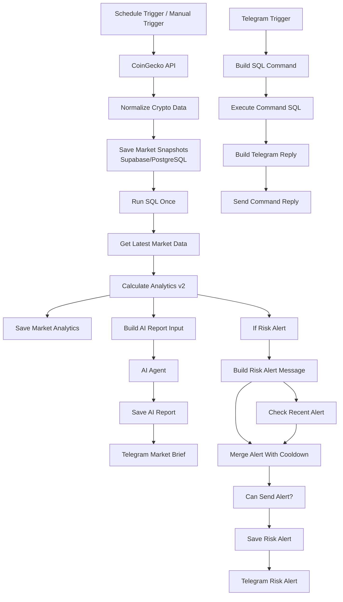

# Crypto Market Intelligence Automation

An automated crypto market intelligence system built with **n8n**, **Supabase/PostgreSQL**, **CoinGecko API**, **OpenAI**, and **Telegram Bot API**.

The system collects crypto market data on a schedule, stores historical snapshots, calculates internal analytics and risk scores, generates AI-powered market briefs, sends Telegram risk alerts, prevents duplicate alert spam with cooldown logic, and supports interactive Telegram commands.

> Disclaimer: This project is for educational and analytical purposes only. It does not provide financial, investment, or trading advice.

---

## Project Overview

This project was built as a portfolio automation system focused on crypto market monitoring and workflow automation.

The main goals were:

- automate crypto market data collection;
- store historical market snapshots;
- calculate internal analytics and risk metrics;
- detect unusual market activity;
- generate short AI market reports;
- send Telegram risk alerts;
- prevent duplicate alerts using cooldown logic;
- provide interactive Telegram commands for quick market checks.

---

## Tech Stack

- **n8n** — workflow automation
- **CoinGecko API** — crypto market data source
- **Supabase / PostgreSQL** — database and historical storage
- **OpenAI GPT model** — AI market brief generation
- **Telegram Bot API** — reports, alerts, and command interface
- **JavaScript Code nodes** — normalization, analytics logic, formatting
- **SQL** — latest snapshot selection, aggregation, history queries

---

## Main Features

### 1. Scheduled Market Data Collection

The main workflow runs automatically every 4 hours and collects market data from CoinGecko.

Tracked assets:

- Bitcoin
- Ethereum
- Solana
- BNB
- XRP
- Chainlink
- NEAR
- Arbitrum
- Optimism

The workflow also supports manual execution for testing.

---

### 2. Market Snapshot Storage

Raw market data is normalized and stored in PostgreSQL.

Table: `crypto_market_snapshots`

Stored fields include:

- coin ID;
- ticker symbol;
- asset name;
- USD price;
- market cap;
- 24h trading volume;
- 24h price change;
- 7d price change;
- snapshot timestamp.

---

### 3. Analytics Engine

The system calculates internal analytics for every tracked asset.

Table: `crypto_market_analytics`

Calculated metrics include:

- `volume_spike`
- `momentum_score`
- `volume_score`
- `trend_score`
- `volatility_score`
- `risk_score`
- `risk_level`
- `forecast_scenario`
- `confidence_score`
- `trigger_reasons`

The `risk_score` is an internal project metric based on price movement and volume behavior. It is not an objective market risk rating.

---

### 4. AI Market Brief

After analytics are calculated, the workflow prepares structured market data and sends it to an AI Agent.

The AI Agent generates a short Telegram-friendly market brief in Russian with HTML formatting.

The report includes:

- market overview;
- top 24h mover;
- top 7d mover;
- weakest asset;
- highest internal risk assets;
- volume spike observations;
- scenario-based outlook;
- disclaimer.

Reports are stored in:

Table: `crypto_ai_reports`

---

### 5. Risk Alert System

The system sends a Telegram Risk Alert when one or more internal conditions are met:

- `risk_score >= 60`
- `volume_spike >= 2`
- `price_change_24h >= 8`
- `price_change_24h <= -8`

Each alert includes:

- asset name and ticker;
- current price;
- 24h and 7d price movement;
- volume spike;
- internal risk score;
- alert reason;
- scenario;
- disclaimer.

Alerts are stored in:

Table: `crypto_risk_alerts`

---

### 6. Cooldown / Anti-Spam Logic

To avoid repeated Telegram spam, the workflow checks whether an alert for the same asset has already been sent within the last 12 hours.

If a recent alert exists, the system does not send a duplicate message.

This makes the alerting system more practical and production-like.

---

### 7. Telegram Commands

A separate Telegram command workflow provides interactive access to market data.

Supported commands:

- `/status` — current market overview
- `/risk` — top assets by internal risk score
- `/top` — top 24h movers
- `/alerts` — latest risk alerts
- `/report` — latest AI market brief
- `/help` — available commands

---

## Architecture

---

## Repository Contents

This repository is published as a **case study** for security reasons.

It includes:

- project documentation;
- architecture description;
- database schema;
- risk score logic;
- screenshots of the real n8n workflow, Telegram outputs, and Supabase tables.

The full n8n export is not included because it may contain workflow metadata, webhook IDs, credential references, chat IDs, and other sensitive information.

---

## Screenshots

Suggested screenshots to add:

- `screenshots/n8n-main-workflow.png`
- `screenshots/n8n-telegram-commands.png`
- `screenshots/telegram-market-brief.png`
- `screenshots/telegram-risk-alert.png`
- `screenshots/telegram-status-command.png`
- `screenshots/supabase-tables.png`

---

## What This Project Demonstrates

This project demonstrates practical skills in:

- automation workflow design;
- API integration;
- data normalization;
- PostgreSQL database design;
- SQL queries and historical data processing;
- JavaScript logic inside n8n workflows;
- AI Agent integration;
- Telegram bot automation;
- risk alerting logic;
- cooldown / anti-spam mechanism;
- building a real-world automation product.

---

## Security Note

No API keys, Telegram bot tokens, Supabase credentials, OpenAI credentials, webhook IDs, or private chat IDs are included in this repository.

---

## Future Improvements

Possible future improvements:

- add more crypto assets;
- add exchange-specific data;
- add news sentiment analysis;
- add on-chain metrics;
- add custom user thresholds;
- add dashboard visualization;
- add multi-language report generation;
- deploy the workflow to a cloud environment.

---

## Disclaimer

This system is an automated analytics project for educational and portfolio purposes.

It does not provide financial, investment, or trading advice.
